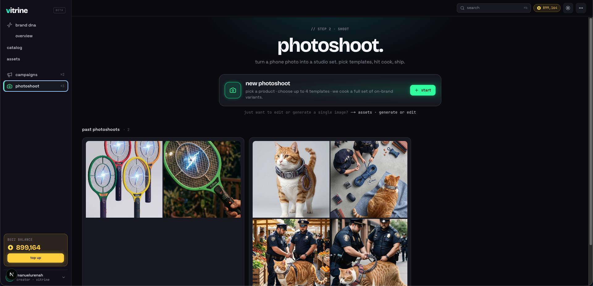

# Campaigns Reviews

## Campaign Details Page (/campaigns/[id])

- Let's change the layout of the generated creatives in the campaign details view to be a row for each creative instead of a card. For example, if the user selected to generated 5 variants for IG Story, IG Feed and LinkedIn, then the first row start with the social media variant (Instagram Story) with the status badge right next to it. Down below is a horizontal list of all the images belonging to that variant, each image has the three dots context menu with the options and user can click into the image to edit the header, description, cta, etc. We can omit showing the header, description and CTA in the new row list.
- Include global actions for each creative variant like download and redo.

## Creative Editor (/campaigns/[id]/c/[url])

- Right panel should be sticky and scroll with the user.
- Fix layout doesn't have a fixed buzz cost of 3, it should estimated since we make a new request to the orchestrator to create a new generation.
- We can include color palette editing in the right panel in case user wants to play with the colors when creating a new version of the creative.
- Let's include the logo editor as well, it should be send to the orchestrator when creating a new version.
- At the moment, version history seems to not be storing the generated image, cause when moving between versions only the header, description and cta text changes but background image stays the same (I could be wrong please confirm this claim).
- We mention the following 'edit on the right · or click the canvas to inspect' but we don't really allow selecting the elements. This might turn confusing to users since at the end, the text is baked in on the generated image and there's no away for the user to edit the layout of the text or CTA (I could be wrong please confirm this claim).